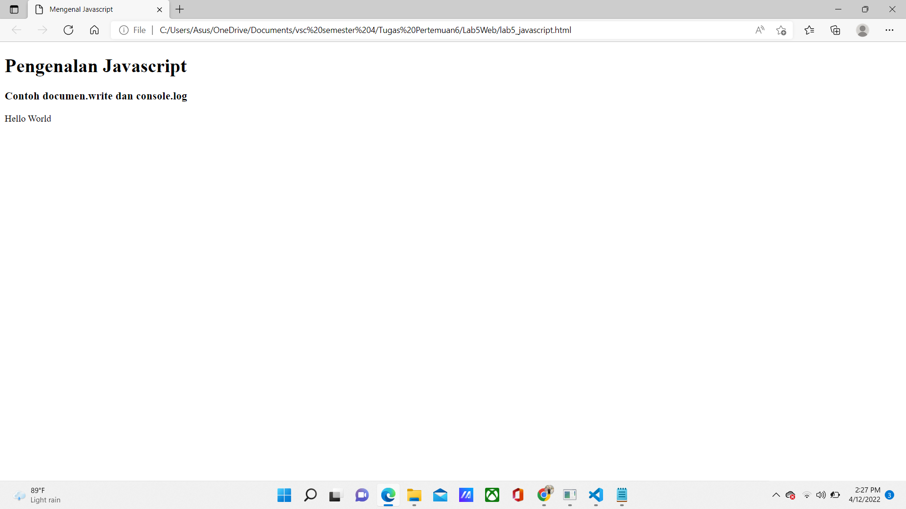
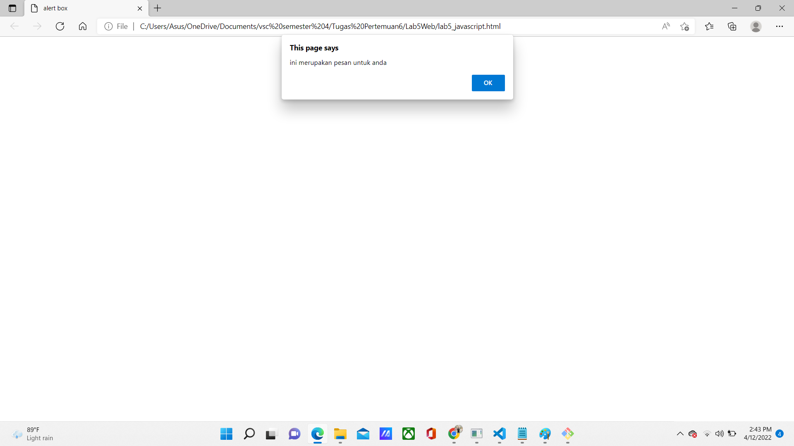
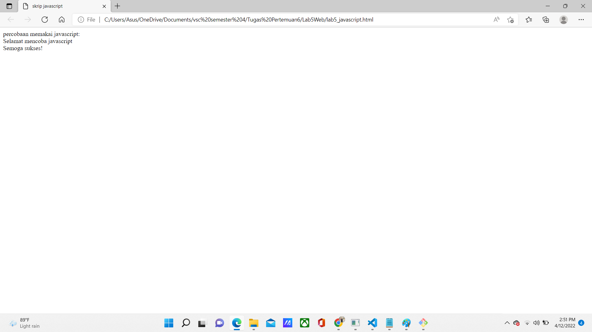

# Lab 5 Web
<hr>
Nama    : Maulana Muhamad <br>

NIM     : 312010188 <br>

Kelas   : TI.20. A.1 <br>
<hr>

## Langkah-langkah Praktikum
### 1.Persiapan membuat dokumen HTML dengan nama file lab5_javascript.html seperti berikut.

 
Gambar di atas adalah hasil codingan yang dibawah.

### Dibawah ini Adalah Codingan Dari Gambar Diatas:

```html
<!DOCTYPE html>
<html lang="en">
<head>
    <meta charset="UTF-8">
    <meta http-equiv="X-UA-Compatible" content="IE=edge">
    <meta name="viewport" content="width=device-width, initial-scale=1.0">
    <title>Mengenal Javascript</title>
</head>
<body>
    <h1>Pengenalan Javascript</h1>
    <h3>Contoh documen.write dan console.log</h3>
    <script>
        document.write("Hello World");
        console.log("Hello World");
    </script>
</body>
</html>
```

### 2.Pemakaian alert sebagai operasi window
 
Gambar di atas adalah hasil codingan yang dibawah yang telah ditambahkan Pemakaian alert sebagai property window dan akan muncul di atas halaman.

### Dibawah ini Adalah Codingan Dari Gambar Diatas:

```html
<!DOCTYPE html>
<html lang="en">
<head>
   <meta charset="UTF-8">
   <meta http-equiv="X-UA-Compatible" content="IE=edge">
   <meta name="viewport" content="width=device-width, initial-scale=1.0">
   <title>alert box</title>
</head>
<body>
   <script lang="javascript">
       window.alert("ini merupakan pesan untuk anda");
   </script>
</body>
</html>
```

### 3.Pemakaian Method Dalam Objek
 
Gambar di atas adalah hasil codingan yang dibawah yang Menggunakan Method dalam objek dengan javascript.

### Dibawah ini Adalah Codingan Dari Gambar Diatas:

```html
<!DOCTYPE html>
<html lang="en">
<head>
    <meta charset="UTF-8">
    <meta http-equiv="X-UA-Compatible" content="IE=edge">
    <meta name="viewport" content="width=device-width, initial-scale=1.0">
    <title>skrip javascript</title>
</head>
<body>
    percobaan memakai javascript:<br>
    <script lang="javascript">
        document.write("Selamat mencoba javascript<br>");
        document.write("Semoga sukses!");
    </script>
</body>
</html>
```

### 4.Pemakaian Prompt
 
Gambar di atas adalah hasil codingan yang dibawah yang Menggunakan Prompt pada script.

### Dibawah ini Adalah Codingan Dari Gambar Diatas:

```html
<!DOCTYPE html>
<html lang="en">
<head>
    <meta charset="UTF-8">
    <meta http-equiv="X-UA-Compatible" content="IE=edge">
    <meta name="viewport" content="width=device-width, initial-scale=1.0">
    <title>pemasukan data</title>
</head>
<body>
    <script lang="javascript">
        var nama = prompt("siapa nama anda?","masukkan nama anda");
        document.write("hai, "+ nama);
    </script>
</body>
</html>
```