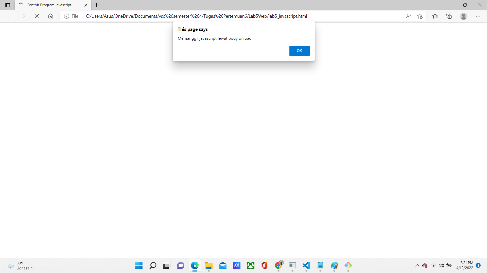
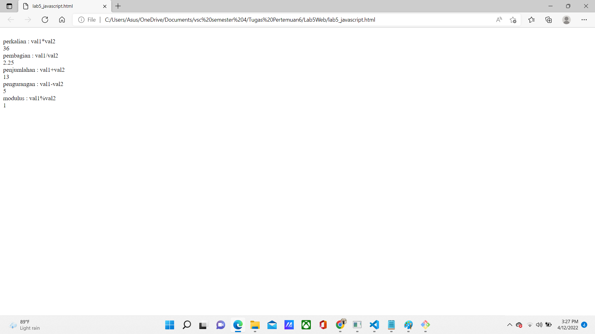
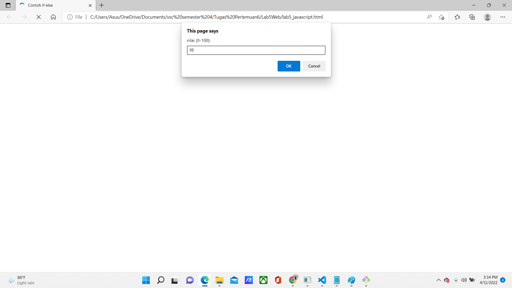
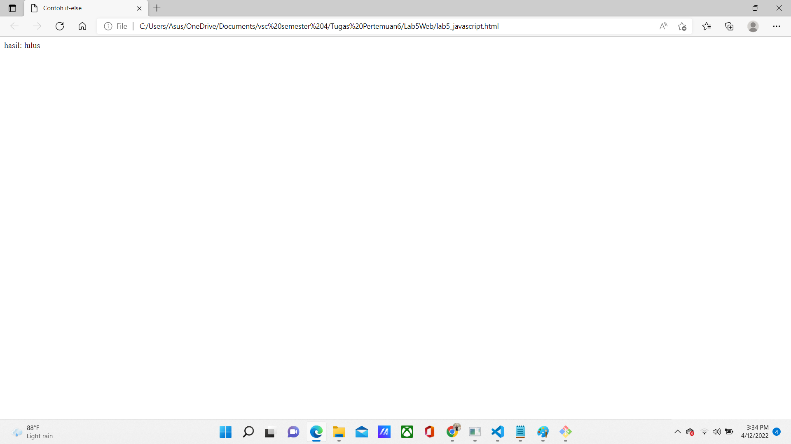

# Lab 5 Web
<hr>
Nama    : Maulana Muhamad <br>

NIM     : 312010188 <br>

Kelas   : TI.20. A.1 <br>
<hr>

## Langkah-langkah Praktikum
### 1.Persiapan membuat dokumen HTML dengan nama file lab5_javascript.html seperti berikut.

 
Gambar di atas adalah hasil codingan yang dibawah.

### Dibawah ini Adalah Codingan Dari Gambar Diatas:

```html
<!DOCTYPE html>
<html lang="en">
<head>
    <meta charset="UTF-8">
    <meta http-equiv="X-UA-Compatible" content="IE=edge">
    <meta name="viewport" content="width=device-width, initial-scale=1.0">
    <title>Mengenal Javascript</title>
</head>
<body>
    <h1>Pengenalan Javascript</h1>
    <h3>Contoh documen.write dan console.log</h3>
    <script>
        document.write("Hello World");
        console.log("Hello World");
    </script>
</body>
</html>
```
<hr>

### 2.Pemakaian alert sebagai operasi window
 
Gambar di atas adalah hasil codingan yang dibawah yang telah ditambahkan Pemakaian alert sebagai property window dan akan muncul di atas halaman.

### Dibawah ini Adalah Codingan Dari Gambar Diatas:

```html
<!DOCTYPE html>
<html lang="en">
<head>
   <meta charset="UTF-8">
   <meta http-equiv="X-UA-Compatible" content="IE=edge">
   <meta name="viewport" content="width=device-width, initial-scale=1.0">
   <title>alert box</title>
</head>
<body>
   <script lang="javascript">
       window.alert("ini merupakan pesan untuk anda");
   </script>
</body>
</html>
```
<hr>

### 3.Pemakaian Method Dalam Objek
 
Gambar di atas adalah hasil codingan yang dibawah yang Menggunakan Method dalam objek dengan javascript.

### Dibawah ini Adalah Codingan Dari Gambar Diatas:

```html
<!DOCTYPE html>
<html lang="en">
<head>
    <meta charset="UTF-8">
    <meta http-equiv="X-UA-Compatible" content="IE=edge">
    <meta name="viewport" content="width=device-width, initial-scale=1.0">
    <title>skrip javascript</title>
</head>
<body>
    percobaan memakai javascript:<br>
    <script lang="javascript">
        document.write("Selamat mencoba javascript<br>");
        document.write("Semoga sukses!");
    </script>
</body>
</html>
```
<hr>

### 4.Pemakaian Prompt
 
 
Gambar di atas adalah hasil codingan yang dibawah yang Menggunakan Prompt pada script.

### Dibawah ini Adalah Codingan Dari Gambar Diatas:

```html
<!DOCTYPE html>
<html lang="en">
<head>
    <meta charset="UTF-8">
    <meta http-equiv="X-UA-Compatible" content="IE=edge">
    <meta name="viewport" content="width=device-width, initial-scale=1.0">
    <title>pemasukan data</title>
</head>
<body>
    <script lang="javascript">
        var nama = prompt("siapa nama anda?","masukkan nama anda");
        document.write("hai, "+ nama);
    </script>
</body>
</html>
```
<hr>

### 5.Pembuatan Fungsi Dan Cara Pemanggilannya
 
Gambar di atas adalah hasil codingan yang dibawah.

### Dibawah ini Adalah Codingan Dari Gambar Diatas:

```html
<!DOCTYPE html>
<html lang="en">
<head>
    <meta charset="UTF-8">
    <meta http-equiv="X-UA-Compatible" content="IE=edge">
    <meta name="viewport" content="width=device-width, initial-scale=1.0">
    <title>Contoh Program javascript</title>
    <script lang="javascript">
        function pesan(){
            alert ("Memanggil javascript lewat body onload")
        }
    </script>
</head>
<body onload=pesan()>
    
</body>
</html>
```
<hr>

## Dasar Pemrograman di Javascript

### 6.Operasi Dasar Aritmatika
 
Gambar di atas adalah hasil codingan yang dibawah Operasi Dasar Artimatika dalam javascript.

### Dibawah ini Adalah Codingan Dari Gambar Diatas:

```html
<!DOCTYPE html>
<html lang="en">
<head>
    <meta charset="UTF-8">
    <meta http-equiv="X-UA-Compatible" content="IE=edge">
    <meta name="viewport" content="width=device-width, initial-scale=1.0">
    <title>Contoh Program Javascript</title>
    <script lang="javascript">
        function test (val1,val2)
        {
            document.write("<br>"+"perkalian : val1*val2 "+"<br>")
            document.write(val1*val2)
            document.write("<br>"+"pembagian : val1/val2 "+"<br>")
            document.write(val1/val2)
            document.write("<br>"+"penjumlahan : val1+val2 "+"<br>")
            document.write(val1+val2)
            document.write("<br>"+"pengurangan : val1-val2 "+"<br>")
            document.write(val1-val2)
            document.write("<br>"+"modulus : val1%val2 "+"<br>")
            document.write(val1%val2)
        }
    </script>
</head>
<body>
    <input type="button" name="button1" value="arithmetic" onclick=test(9,4)>
</body>
</html>
```

<hr>

### 7.Seleksi Kondisi (If/else)
 
 
Gambar di atas adalah hasil codingan yang dibawah yang menggunakan program seleksi bersyarat dari if else dimana jika jika nilainya lebih dari 60 berarti lulus dan yang lain jika dibawah 60 berarti tidak lulus, sedangkan saya memberikan nilai 98 yang berarti hasilnya adalah lulus

### Dibawah ini Adalah Codingan Dari Gambar Diatas:

```html
<!DOCTYPE html>
<html lang="en">
<head>
    <meta charset="UTF-8">
    <meta http-equiv="X-UA-Compatible" content="IE=edge">
    <meta name="viewport" content="width=device-width, initial-scale=1.0">
    <title>Contoh if-else</title>
</head>
<body>
    <script lang="javascript">
        var nilai = prompt("nilai (0-100): ", 0);
        var hasil = "";
        if (nilai >=60)
        hasil = "lulus";
        else
        hasil = "tidak lulus";
        document.write("hasil: " + hasil);
    </script>
</body>
</html>
```

<hr>